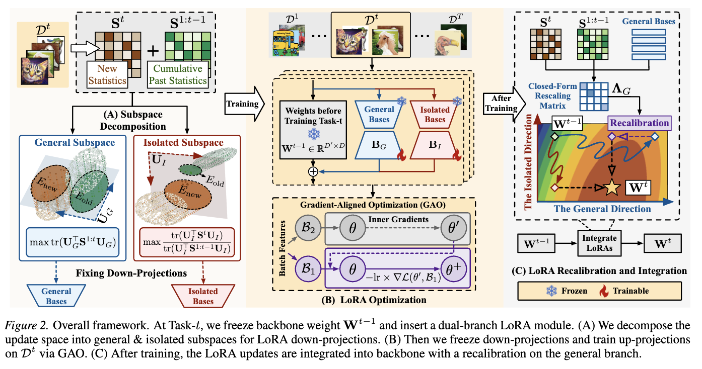

# [ICML 2026 -- Task-Driven Subspace Decomposition for Knowledge Sharing and Isolation in LoRA-based Continual Learning ](https://arxiv.org/abs/2603.00191)

## Abstract

<div align="justify">
Continual Learning (CL) requires models to sequentially adapt to new tasks without forgetting old knowledge. Recently, Low-Rank Adaptation (LoRA), a representative Parameter-Efficient Fine-Tuning (PEFT) method, has gained increasing attention in CL. Several LoRA-based CL methods reduce interference across tasks by separating their update spaces, typically building the new space from the estimated null space of past tasks. However, they (i) overlook task-shared directions, which suppresses knowledge transfer, and (ii) fail to capture truly effective task-specific directions since these ``null bases" of old tasks can remain nearly inactive for new task under correlated tasks. To address this, we study LoRA learning capability from a projection energy perspective, and propose Low-rank Decomposition and Adaptation (LoDA). It performs a task-driven decomposition to build general and truly task-specific LoRA subspaces by solving two energy-based objectives, decoupling directions for knowledge sharing and isolation. LoDA fixes LoRA down-projections on two subspaces and learns robust up-projections via a Gradient-Aligned Optimization (GAO) approach. After each task, before integrating the LoRA updates into the backbone, LoDA derives a closed-form recalibration for the general update, approximating a feature-level joint optimum along this task-shared direction. Experiments indicate that LoDA outperforms existing CL methods.
</div>

 The overall framework of our proposed method *Low-rank Decomposition and Adaptation* (LoDA).

## Dataset preparation
* Create a folder for datasets in your workspace directory `./datasets/`
* **CIFAR 100**: Should be automatically downloaded
* **ImageNet-R**, **ImageNet-A**, **CUB-200**: Download the pre-processed datasets from [PILOT: A Pre-Trained Model-Based Continual Learning Toolbox](https://github.com/sun-hailong/LAMDA-PILOT)

## Enviornment
We recommend creating a clean Python environment before running this project.

```bash
conda create -n your_env_name python=3.9 -y
conda activate your_env_name
pip install --upgrade pip
pip install -r requirements.txt
```

> "seed": [1993, 1996, 1997],

## Train

Run the following commands to train the model on different benchmarks.  
The argument `--device "0"` specifies the GPU ID used for training.

### ImageNet-R (10 Tasks)

```bash
python main.py --device "0" --config ./exps/imgr10.json
```

### CIFAR-100 (10 Tasks)

```bash
python main.py --device "0" --config ./exps/cifar10.json
```

### ImageNet-A (10 Tasks)

```bash
python main.py --device "0" --config ./exps/imga10.json
```

### CUB-200 (10 Tasks)

```bash
python main.py --device "0" --config ./exps/cub10.json
```

## Contact
If you have any questions about our work or this repository, please contact us by email.
* lingfenghe077@gmail.com

## Citation
```
@inproceedings{
he2026task,
title={Task-Driven Subspace Decomposition for Knowledge Sharing and Isolation in LoRA-based Continual Learning},
author={Lingfeng He and De Cheng and Huaijie Wang and Xiaofeng Zhu and Xi Yang and Nannan Wang and Xinbo Gao},
booktitle={Forty-third International Conference on Machine Learning},
year={2026}
}
```

## Acknoledgements
Our work is built on the following repo, we appreciate their great work
- [PILOT: A Pre-Trained Model-Based Continual Learning Toolbox](https://github.com/sun-hailong/LAMDA-PILOT)


